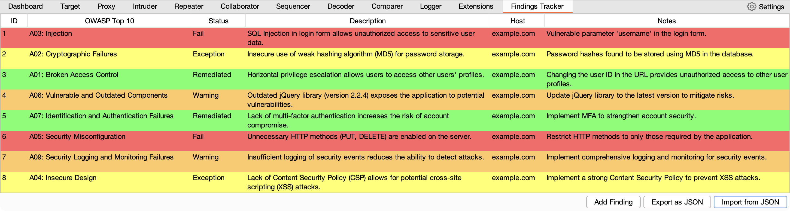

<p align="center">
<h1 align="center">Findings Tracker</h1></p>

Findings Tracker is a Burp Suite extension that helps penetration testers and security researchers manage and track their findings during web application assessments. This extension provides an easy-to-use table for organizing findings, with support for import/export to JSON files, automatic saving of changes, color-coding of findings based on the status, and columns for relevant data such as OWASP Top 10, status, description, and notes. With the Findings Tracker extension, users can efficiently manage, document, and collaborate on security findings discovered during web application assessments.

The Findings Tracker extension allows users to quickly send HTTP requests and responses from other Burp Suite tools, such as Proxy, Repeater, or Intruder, directly to the Findings Tracker. This streamlines the process of documenting and organizing security findings during the assessment.

The extension also supports importing and exporting findings as JSON files. This feature makes it easy for users to share and collaborate on findings with their team members or to maintain a historical record of findings across multiple assessment projects.

In summary, the Findings Tracker Burp Suite extension is a valuable tool for security professionals looking to simplify and streamline their web application security testing process. By offering an organized and efficient method for managing, documenting, and collaborating on findings, the extension allows users to focus on what matters most—identifying and remediating security vulnerabilities.



## Requirements

Ensure you have Burp Suite installed on your system. You can download the free Community edition or purchase the Professional edition from the official website: https://portswigger.net/burp

Make sure you have the Jython Standalone JAR file on your system. You can download it from the Jython website: https://www.jython.org/download

If you need to setup Jython you can follow these steps:
1. Open Burp Suite and go to the "Extender" tab.

2. Click on the "Options" sub-tab.

3. Under the "Python Environment" section, locate the "Folder for loading modules" field and set it to the directory where the Jython Standalone JAR file is stored. Alternatively, you can click "Select file..." and browse to the location of the Jython Standalone JAR file.

## Installation

1. Download ```findings-tracker.py```

2. Open Burp Suite and go to the "Extender" tab.

3. Click on the "Extensions" sub-tab.

4. Click the "Add" button, and in the "Add extension" dialog, select "Python" from the "Extension type" dropdown.

5. Click "Select file..." and browse to the location where you have saved the ```findings-tracker.py``` Python script for the Burp Suite extension.

Click "Next" to load the extension. If everything is configured correctly, you should see a message that says "Findings Tracker loaded." You should now see the extension listed in the "Loaded extensions" section.

During the installation process, the Findings Tracker extension will create a dedicated directory named Findings Tracker within the user's Documents/Burp Suite folder. This directory will be used for storing and organizing JSON files related to the findings.

## Usage

Now the extension is installed, and you can use it to manage, document, and collaborate on security findings discovered during web application assessments. Once the first finding is added you will be prompted to export the findings data to a JSON file. After the data is saved, any future changes in the Findings Tracker will automatically be saved to the file you selected.

- To add a new finding manually, click the "Add Finding" button and fill in the relevant details in the table.
- To create a finding from other Burp Suite tools (such as Proxy, Repeater, or Intruder), right-click on the request/response and select "Send to Findings Tracker".
- Use the drop-down menus in the table to change the status, OWASP Top 10 category and status of a finding.
- To import findings from a JSON file, click the "Import from JSON" button and select the file. The table will be updated with the imported findings, and the file will be used for future automatic saves.
- To export findings to a JSON file, click the "Export as JSON" button. If you have previously imported findings, the extension will automatically save the changes to the same JSON file. If not, you will be prompted to choose a location and file name for the export.

With the Findings Tracker Burp Extension, you can easily manage and track your findings during web application assessments, making it simple to maintain organized records of your work.

The ```demo-findings.json``` file provides eight example findings you can use to populate the Findings Tracker for a demo. These findings cover various OWASP Top 10 categories and different severity levels. These findings can be used to demonstrate how to use the Findings Tracker to track different types of vulnerabilities and risks discovered during an application security penetration test.
